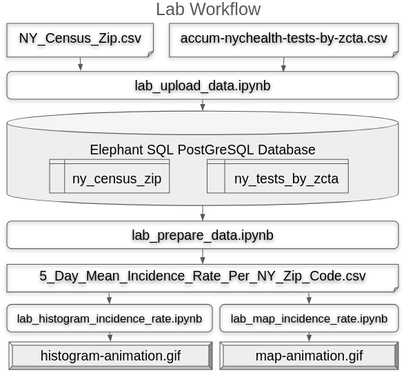

## Elephant SQL Account
You'll need to create a free tier Elephant SQL account. [https://www.elephantsql.com/plans.html](https://www.elephantsql.com/plans.html). Get the Tiny Turtle tier.


## Install Mamba

Mambaforge is a common python tool and instructions online are plentiful

## Create conda environment
```
mamba env create -f environment.yml
```
## Activate new conda environment
```
conda activate usf-database
```
## Start Jupyter Lab
```
jupyter lab
```
## Lab Workflow
